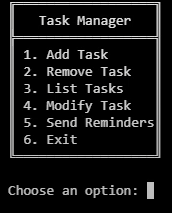
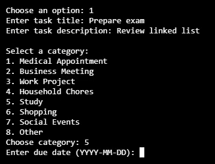
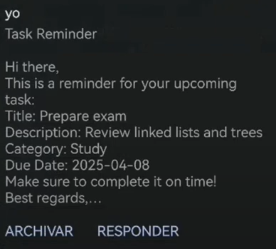
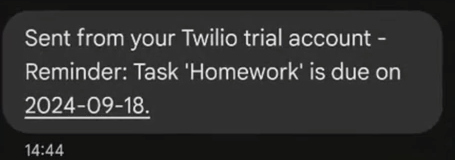

# Task Manager with Reminder Notifications 🚀

#### Description:
Task Manager with Reminder Notifications is a Python-based application designed to help users manage their daily tasks efficiently. The program allows users to add, remove, list, and modify tasks, as well as send reminders via Gmail or SMS using Twilio. Tasks are stored persistently in a CSV file, and environment variables are used for secure credential management. This project demonstrates skills in data management, integration with external APIs, and handling dates and times—all essential abilities for modern software development.

## Table of Contents
- [Features](#features-✨)
- [Tech Stack](#tech-stack-🖥️)
- [Demo](#demo-🎞️)
- [Project Structure](#project-structure-📁)
- [Installation](#installation-💻)
- [Configuration](#configuration-🔧)
- [Usage](#usage-🚀)
- [Integration with External APIs](#integration-with-external-apis-🌎)
- [License](#license-📜)
- [Contact](#contact-🧑🏽‍💻)


## Features ✨
- **Add Task:** Create a new task by providing a title, description, category (from a predefined list), and a due date.
- **Remove Task:** Delete an existing task by selecting its number from a list.
- **List Tasks:** Display all tasks in a neatly numbered list for easy reference.
- **Modify Task:** Update details of an existing task, including title, description, category, and due date.
- **Send Reminders:** Send personalized reminders for tasks via SMS (using Twilio) or Gmail.
- **CSV Storage:** Tasks are stored in a CSV file, ensuring data persistence even after the program ends.
- **Secure Credentials:** Uses a `.env` file to manage sensitive information like API keys and passwords.

## Tech Stack 🖥️
- **Language:** Python  
- **Notifications:** Twilio (SMS), Gmail (Email)  
- **Storage:** CSV  
- **Credential Management:** dotenv  

## Demo 🎞️
Below are example screenshots showing the application in action.

<p align="center">
  <br>
  <em>Main Menu - Initial screen showing available options.</em>
</p>

<p align="center">
  <br>
  <em>Adding a Task - Example of entering task details in the CLI.</em>
</p>

<p align="center">
  <br>
  <em>Gmail Notification - Email reminder sent by the application.</em>
</p>

<p align="center">
  <br>
  <em>SMS Notification - Reminder sent via Twilio.</em>
</p>
## Project Structure 📁

```
task-manager-python/
├── .gitignore
├── README.md
├── project.py
├── requirements.txt
├── tasks.csv
└── test_project.py
```

## Installation 💻
1. **Clone the repository:**
    ```bash
    git clone https://github.com/yourusername/your-repo.git
    cd your-repo
    ```
2. **Create a virtual environment (recommended):**
    ```bash
    python -m venv venv
    source venv/bin/activate  # On Windows: venv\Scripts\activate
    ```
3. **Install the dependencies:**
    ```bash
    pip install -r requirements.txt
    ```

## Configuration 🔧
Create a file named `.env` in the project root with the following content:

```env
# Twilio Credentials (for sending SMS)
TWILIO_ACCOUNT_SID=your_twilio_account_sid
TWILIO_AUTH_TOKEN=your_twilio_auth_token
TWILIO_PHONE_NUMBER=your_twilio_phone_number

# Gmail Credentials (for sending email notifications)
SENDER_EMAIL=your_email@gmail.com
SENDER_PASSWORD=your_app_password
```

## Usage 🚀
1. **Run the application:**
   ```bash
    python project.py
    ```
2. **Interaction**
- **Add Task:** Follow the on-screen instructions to input the title, description, category, and due date.
- **Remove a Task:** Select the task number you wish to delete.
- **List Tasks:** Displays all the tasks stored in the CSV file.
- **Modify a Task:** Choose a task from the list and update its details.
- **Send Reminders:** The application can send automated reminders via email or SMS based on the configured settings.

## Integration with External APIs 🌎
- **Twilio:** Used to send SMS reminders. Make sure your credentials in the .env file are correct and that your Twilio account is configured to send messages.
- **Gmail:** Used to send email notifications. Remember to generate an application-specific password if you have two-factor authentication enabled on your Gmail account.

## Final Considerations 🔚
- **Data Persistence:** All tasks are stored in a CSV file, ensuring the data remains available even after the program ends.
- **Security:** Credentials are handled through the .env file, following best practices for managing sensitive information.
- **Scalability:** The modular design allows you to extend the functionality of the task manager, adding new features or integrations as needed.

## License 📜
Distributed under the MIT License. See [`LICENSE`](LICENSE) for details.

## Contact 🧑🏽‍💻

* **GitHub:** [AlexanderMenMen](https://github.com/AlexanderMenMen)
* **LinkedIn:** [Alexander Mendoza Mendoza](https://www.linkedin.com/in/alexander-mendoza-mendoza-876255214/)
